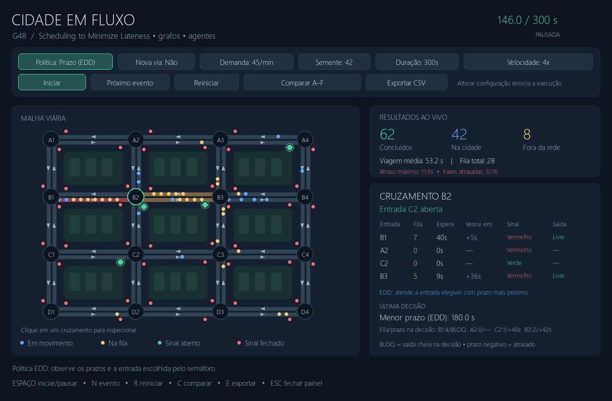
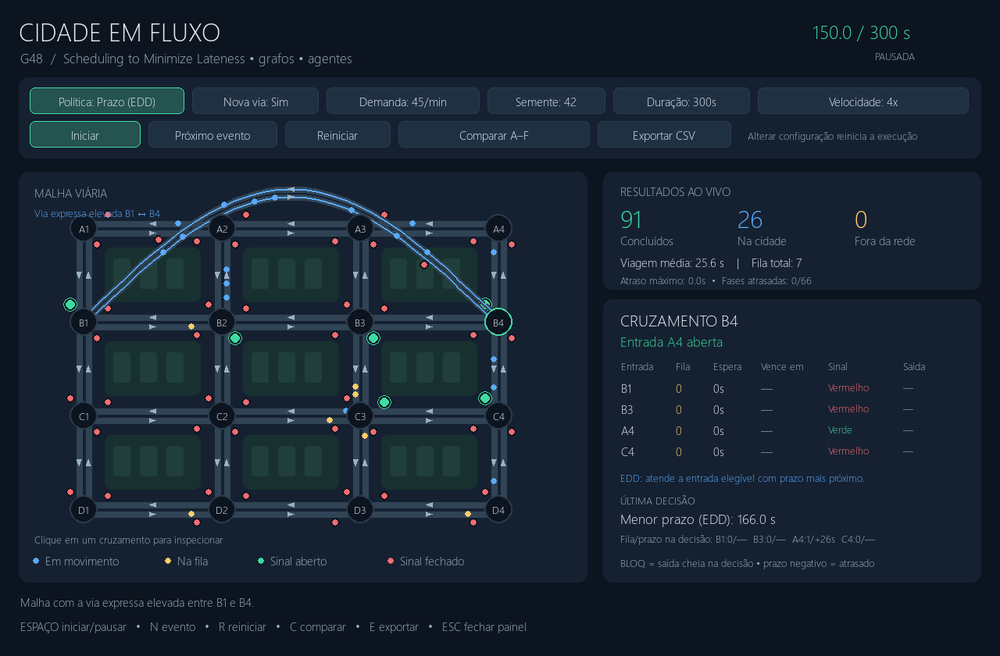
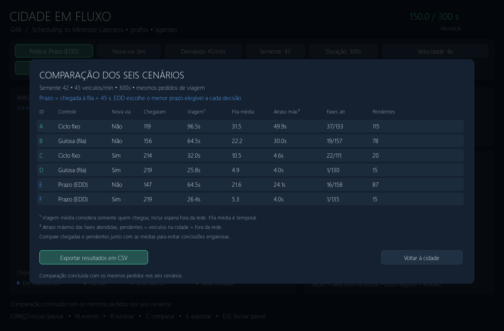

# Greed_Simulador-de-Cidade

**Número da Lista**: 48<br>
**Conteúdo da Disciplina**: Algoritmos Ambiciosos (Gulosos)<br>
**Nome da aplicação**: Cidade em Fluxo<br>
**Status**: implementado em Python, com interface visual e experimentos por terminal.

## Alunos

| Matrícula | Aluno |
| -- | -- |
| 221007724 | Gabriel Sousa Silva |
| 231011696 | Luiz Guilherme Morais da Costa Faria |

## Sobre

Cidade em Fluxo é um simulador acadêmico que permite observar como semáforos e uma nova via afetam os congestionamentos. A cidade é um grafo dirigido de 16 cruzamentos; veículos são agentes com origem, destino, rota e estado. Um motor de eventos discretos controla chegadas, filas e liberações de passagem.

O foco acadêmico agora é **Scheduling to Minimize Lateness**, implementado de forma independente na pasta [`scheduling_minimize_lateness/`](simulador-cidade/scheduling_minimize_lateness/). O algoritmo clássico ordena tarefas pelo prazo mais próximo para minimizar o maior atraso em uma única máquina. No trânsito, cada fase elegível de um cruzamento recebe um prazo; o semáforo escolhe primeiro a fase cujo prazo vence antes. A interface e os experimentos comparam essa política com ciclo fixo e com a regra anterior de maior fila, em malhas com e sem a nova via.

## Instalação

**Linguagem**: Python 3.13 recomendado (ambiente utilizado na validação)<br>
**Interface**: Pygame 2.6.1<br>
**Grafos e rotas**: NetworkX 3.6.1<br>
**Eventos e testes**: `heapq` e `unittest`, da biblioteca padrão.

No PowerShell, dentro da pasta do projeto:

```powershell
py -3.13 -m venv .venv
.\.venv\Scripts\python.exe -m pip install -r requirements.txt
.\.venv\Scripts\python.exe main.py
```

Não é necessário ativar o ambiente virtual. Se as dependências já estiverem instaladas no Python 3.13, também é possível executar diretamente:

```powershell
py -3.13 main.py
```

## Uso

1. Escolha **Prazo (EDD)**, **Fila maior** ou **Ciclo fixo** e habilite ou desabilite a **Nova via**.
2. Configure a demanda, a semente e a duração. Cada botão percorre os valores disponíveis; a semente aumenta em uma unidade.
3. Clique em **Iniciar**. Veículos azuis estão em movimento; amarelos estão nas filas. Os carros são desenhados na ordem da via: quem ainda está em movimento fica atrás da cauda da fila. Ruas mais ocupadas ficam mais avermelhadas.
4. Clique em um cruzamento para consultar as filas por entrada, o tempo de espera do primeiro veículo, o prazo de atendimento, o sinal e a disponibilidade da próxima rua. A lâmpada verde indica a entrada com passagem aberta; **"Saída: Livre"** indica somente que há espaço adiante e não autoriza a passagem durante o vermelho. No histórico da última decisão, `BLOQ` significa que a rua seguinte estava cheia naquele instante; ela pode estar livre quando você consultar o painel depois.
5. Pause e clique em **Próximo evento** para acompanhar a lógica passo a passo. Vários eventos podem ocorrer no mesmo instante.
6. Clique em **Comparar** para executar os seis cenários A–F com a mesma demanda. A comparação pausa a execução atual e abre uma tabela de resultados.
7. Use **Exportar CSV** para salvar a comparação ou, se nenhuma comparação tiver sido executada, as métricas da execução atual em `resultados/`.

Alterar política, via, demanda, semente ou duração reinicia a simulação e limpa a comparação anterior. A velocidade de reprodução não altera os resultados. Reiniciar mantém os parâmetros e reproduz os mesmos pedidos de viagem.

| Ação | Controle |
| -- | -- |
| Iniciar ou pausar | Botão ou `Espaço` |
| Processar um evento e pausar | Botão ou `N` |
| Reiniciar com a mesma configuração | Botão ou `R` |
| Comparar os seis cenários | Botão ou `C` |
| Exportar CSV | Botão ou `E` |
| Fechar comparação ou cancelar seu cálculo | `Esc` |
| Inspecionar cruzamento | Clique no círculo do cruzamento |
| Alterar velocidade visual | Botão: 1×, 4×, 10× ou 20× |

A interface oferece demandas de 20, 45 e 80 veículos/minuto e durações de 120, 300 e 600 segundos. Parâmetros personalizados podem ser definidos ao iniciar. Sem `--comparar`, informe uma semente e uma demanda; `--saida` se aplica somente à comparação por terminal:

```powershell
py -3.13 main.py --sementes 7 --demandas 60 --duracao 450
```

## Algoritmos e modelagem

### Cidade e agentes

- **Grafo dirigido**: 16 nós, nomeados de A1 a D4, e 48 arestas na malha original. Uma rua de mão dupla corresponde a duas arestas.
- **Ruas comuns**: comprimento de 120 m, velocidade nominal de 48 km/h, percurso livre de 9 s e capacidade de 9 veículos por sentido.
- **Nova via**: conexão expressa elevada entre B1 e B4, nos dois sentidos, sem cruzamentos intermediários. Cada sentido tem 300 m, velocidade nominal de 72 km/h, percurso de 15 s e capacidade de 15 veículos. O desenho é esquemático, sem escala física.
- **Veículos**: agentes com rota fixa, que passam pelos estados de espera externa, movimento, fila e viagem concluída. São admitidos e liberados respeitando a capacidade das ruas.
- **Filas FIFO**: o veículo mais antigo passa primeiro. Quem aguarda no semáforo continua ocupando espaço na rua de chegada. Se a próxima rua está cheia, o primeiro veículo bloqueia sua fila.
- **Entradas externas**: cada origem mantém uma fila FIFO fora da rede. A admissão tenta liberar um veículo a cada 2 s enquanto há espera; esses veículos são contabilizados separadamente.
- **Destino**: ao chegar ao nó final, o veículo deixa a rede sem aguardar um semáforo para realizar outra conversão.

A demanda é gerada com intervalos exponenciais e taxa configurada em veículos/minuto. Em 60% dos sorteios, a viagem usa o corredor B1–B4 (com 30% dessas viagens no sentido inverso); nos demais, origem e destino são sorteados entre os nós da borda. A semente controla todos esses sorteios.

### Scheduling to Minimize Lateness: algoritmo clássico

O problema clássico recebe tarefas disponíveis desde o início para **uma única máquina**. Cada tarefa `j` tem duração `p_j` e prazo `d_j`. Se termina no instante `C_j`, seu atraso é `L_j = C_j - d_j` (negativo quando termina antes do prazo). O objetivo é minimizar `L_max = max_j L_j`. A solução gulosa **Earliest Deadline First (EDD)** ordena as tarefas por prazo crescente e executa sem ociosidade. A implementação isolada em `scheduling_minimize_lateness/` retorna a ordem, os intervalos de execução e o atraso máximo; os testes a comparam com todas as permutações em instâncias pequenas. Ordenar `n` tarefas custa **O(n log n)**.

Exemplo reproduzível: `A` dura 4 s e vence em 6 s; `B` dura 3 s e vence em 4 s; `C` dura 2 s e vence em 9 s. A ordem EDD é **B → A → C** e tem `L_max = 1 s`; na ordem de entrada A → B → C, `L_max = 3 s`. A ordenação por prazo reduz o maior atraso na formulação clássica; ela não escolhe rotas. Veja a [demonstração e prova da estratégia EDD nas notas de Princeton](https://www.cs.princeton.edu/courses/archive/spr05/cos423/lectures/04greed.pdf).

Para executar a demonstração independente da cidade:

```powershell
py -3.13 -m scheduling_minimize_lateness
```

### Adaptação EDD aos semáforos

Cada **fase elegível** de um cruzamento representa uma tarefa de verde de 10 segundos. O prazo da fase é o instante em que o primeiro carro entrou na fila **mais 45 segundos**. A cada decisão, o controlador EDD escolhe a fase com o prazo absoluto mais próximo. Se a rua seguinte ao primeiro carro estiver cheia, essa fase não é elegível naquele instante. A troca de fase acrescenta 2 segundos de vermelho geral.

O simulador registra a violação de prazo de cada período de verde que teve fila como `max(0, fim_do_verde - prazo)`, além de contar esses períodos e os que terminaram atrasados. Essa métrica positiva difere do `L_max` assinado do algoritmo teórico. Um período pode ser contado mesmo se uma rua cheia impedir a passagem; por isso o número de veículos concluídos deve ser avaliado em separado. Os carros podem chegar durante o processamento, há vários cruzamentos e ruas podem ficar bloqueadas. **Por isso, a prova de optimalidade do problema clássico não se transfere à cidade inteira.** O algoritmo puro demonstra o resultado teórico; a simulação mostra o comportamento de uma política EDD inspirada nele. Para avaliar o efeito real, compare também viagens concluídas, tempo de viagem, filas e veículos que ainda aguardam.

### Política de referência: maior fila

Cada entrada de um cruzamento é uma fase independente. Somente uma entrada recebe verde por vez, permitindo conversões sem liberar simultaneamente entradas conflitantes.

```text
candidatos = fases com fila e espaço na próxima rua do primeiro veículo
se há candidato esperando pelo menos 45 segundos:
    escolher a maior espera
senão:
    escolher a maior fila
empates: fase há mais tempo sem atendimento; depois identificador
```

Exemplo: uma entrada com 8 veículos tem prioridade sobre outra com 3. Se a rua seguinte ao primeiro veículo da fila de 8 estiver cheia, ela fica inelegível e a fila de 3 pode ser atendida. Uma espera de pelo menos 45 s ativa a regra de prioridade por idade, desde que haja espaço na saída.

Cada verde dura 10 s, com liberação de até um veículo a cada 2 s. Trocar a fase inclui 2 s de vermelho geral. Se o guloso escolher novamente a fase atual, o verde continua sem intervalo de transição. A escolha é reavaliada ao fim do verde, sem interrompê-lo por chegadas intermediárias.

**Por que é guloso?** Essa política de referência escolhe a maior fila disponível localmente, sem explorar sequências futuras de decisões. O limite de espera é uma restrição adicional de atendimento, não uma garantia de espera máxima: a rede pode estar bloqueada. Não há garantia de solução global ótima.

A seleção percorre as `k` fases do cruzamento em **O(k)**, usando listas auxiliares com espaço **O(k)**. A implementação está em `algoritmos/__init__.py`.

### Ciclo fixo

Percorre as entradas em uma ordem determinística, com os mesmos 10 s de verde, 2 s de transição e intervalo de saída de 2 s. Não adapta a escolha às filas: pode abrir uma entrada vazia enquanto outra está congestionada. A saída de veículos continua respeitando a capacidade da próxima rua.

### Rotas e eventos discretos

O Dijkstra, do NetworkX, calcula a rota inicial com o tempo nominal de cada rua como peso não negativo. A rota é fixa durante a viagem e é recalculada na criação de cada veículo quando a malha muda. Dijkstra é um apoio à simulação; a comparação principal avalia as políticas dos semáforos.

Os eventos ficam em uma fila de prioridade `heapq`, ordenados por `(instante, prioridade do tipo, sequência de inserção)`. No mesmo instante, entradas e chegadas são processadas antes das decisões e liberações dos semáforos; as admissões externas ocorrem depois das liberações. Assim, uma decisão enxerga as filas que acabaram de receber veículos, e uma origem pode aproveitar espaço recém-liberado. A sequência desempata eventos do mesmo tipo de maneira reproduzível. Inserir e remover eventos custa **O(log E)**, para `E` eventos pendentes, além do processamento de cada evento.

O relógio avança entre eventos de entrada, admissão, chegada, decisão, abertura de verde e liberação. A animação interpola posições entre instantes do motor; a velocidade visual não muda a dinâmica nem as métricas.

## Organização do código

| Arquivo ou pasta | Responsabilidade |
| -- | -- |
| `main.py` | Argumentos do terminal e inicialização |
| `cidade.py` | Grafo, ruas, capacidade e cálculo das rotas |
| `veiculo.py` | Pedidos de viagem e estado dos agentes |
| `semaforo.py` | Estado das fases e parâmetros de controle |
| `scheduling_minimize_lateness/` | EDD clássico, demonstração e hipóteses do teorema |
| `algoritmos/` | Seleção das políticas de semáforo |
| `simulacao.py` | Motor de eventos e interação dos agentes |
| `metricas.py` | Integração temporal das filas |
| `experimentos.py` | Comparações pareadas e exportação CSV |
| `render/` | Interface, mapa, inspeção e tabela de resultados |
| `tests/` | Testes do motor, políticas e interface |
| `capturas.py` | Geração reproduzível das capturas abaixo |

## Experimentos e comparação

| Cenário | Malha viária | Controle |
| -- | -- | -- |
| A | Original | Ciclo fixo |
| B | Original | Maior fila |
| C | Com nova via | Ciclo fixo |
| D | Com nova via | Maior fila |
| E | Original | Prazo (EDD) |
| F | Com nova via | Prazo (EDD) |

Cada conjunto A–F reutiliza exatamente os mesmos pedidos: origens, destinos e horários de chegada. As comparações **E−A** e **E−B** isolam o efeito do EDD na malha original; **F−C** e **F−D** fazem o mesmo com a nova via. A comparação **F−E** mostra o efeito da via sob EDD. As demais comparações preservam as referências anteriores. Como a via altera as rotas escolhidas, seu efeito inclui tanto o novo trecho quanto a redistribuição do tráfego.

Para executar sem janela, com várias sementes e níveis de demanda:

```powershell
py -3.13 main.py --comparar --sementes 42 43 44 --demandas 20 45 80 --duracao 300 --saida resultados/experimentos.csv
```

Esse comando produz **54 linhas** no CSV: seis cenários para cada combinação de três sementes e três demandas. O arquivo usa UTF-8 com BOM e separador `;`. O terminal também mostra diferenças **pareadas por semente**, separadas por demanda. Para cada comparação, apresenta a média e o intervalo mínimo–máximo das diferenças em viagens concluídas, fila média total e atraso máximo de fase. Sementes repetidas são recusadas, pois repetir o mesmo sorteio não representa uma nova repetição experimental.

Leia os sinais das diferenças conforme a métrica: **positivo em concluídos** significa mais viagens terminadas; **negativo em fila média ou atraso máximo** significa menos congestionamento ou menor violação dos prazos nas fases atendidas. A variação entre sementes ajuda a verificar se a conclusão depende de um sorteio específico. O tempo médio de viagem no terminal e no CSV inclui apenas viagens concluídas; acompanhe também `gerados`, `em_circulacao` e `aguardando_entrada` para não interpretar uma média baixa produzida por muitas viagens ainda pendentes.

### Definição das métricas

| Campo no CSV | Significado |
| -- | -- |
| `gerados` | Pedidos de viagem que chegaram até o instante observado |
| `concluidos` | Viagens que chegaram ao destino |
| `em_circulacao` | Veículos em movimento ou nas filas internas |
| `aguardando_entrada` | Veículos na fila externa, ainda fora da rede |
| `viagem_media_s` | Média da chegada ao destino menos o instante do pedido, incluindo espera externa; somente viagens concluídas |
| `espera_media_s` | Espera acumulada nos semáforos por veículo que entrou na rede, incluindo esperas ainda em andamento |
| `espera_maxima_s` | Maior episódio individual de espera em um cruzamento, concluído ou ainda aberto |
| `espera_externa_media_s` | Espera fora da rede por pedido gerado, incluindo os que ainda aguardam entrada |
| `fila_media_total` | Integral da soma das filas internas dividida pelo tempo simulado |
| `fila_maxima_via` | Maior fila observada em uma única rua direcionada |
| `fila_atual_total` | Soma das filas internas no instante observado |
| `fases_atendidas` | Períodos de verde terminados que encontraram uma fila, mesmo se uma saída cheia impediu a passagem |
| `fases_atrasadas` | Desses períodos, quantos terminaram depois do prazo do primeiro carro |
| `atraso_maximo_fase_s` | Maior violação positiva de prazo entre esses períodos; não inclui períodos ainda em andamento |

Se nenhuma viagem terminar, o tempo médio de viagem fica vazio no CSV e aparece como travessão na interface. A simulação para no horizonte configurado sem esvaziar artificialmente a rede. Verifique sempre os veículos restantes: uma média baixa apenas entre os que chegaram pode esconder congestionamento.

### Exemplo reproduzível

Resultados para semente **42**, demanda **45 veículos/min** e duração **300 s**, com 234 pedidos:

| Cenário | Concluídos | Viagem média (s) | Fila média total | Maior atraso de fase (s) | Na cidade | Fora da rede |
| -- | --: | --: | --: | --: | --: | --: |
| A | 119 | 96,5 | 31,5 | 49,9 | 42 | 73 |
| B | 156 | 64,5 | 22,2 | 30,0 | 36 | 42 |
| C | 214 | 32,0 | 10,5 | 4,6 | 20 | 0 |
| D | 219 | 25,8 | 4,9 | 4,0 | 15 | 0 |
| E | 147 | 64,5 | 21,6 | 24,1 | 44 | 43 |
| F | 219 | 26,4 | 5,3 | 4,0 | 15 | 0 |

Nesse exemplo, **E** reduz o maior atraso de fase em relação a **B** (24,1 contra 30,0 s), mas conclui menos viagens (147 contra 156). Isso mostra a diferença entre reduzir atraso máximo e maximizar vazão. A via expressa atende diretamente a demanda predominante e melhora bastante os cenários C, D e F neste modelo. Uma semente não demonstra que qualquer nova rua ou política EDD sempre melhora uma cidade real.

## Screenshots

### Cidade e inspeção do prazo EDD



### Malha com a via expressa elevada



### Comparação dos seis cenários



As capturas são geradas pelo próprio renderizador com a semente 42. Para reproduzi-las sem abrir uma janela:

```powershell
py -3.13 capturas.py
```

## Validação

```powershell
py -3.13 -m unittest discover -s tests -v
```

Os testes cobrem a optimalidade do EDD clássico em instâncias pequenas por comparação com todas as ordens possíveis, a adaptação por prazo no semáforo, desempates, bloqueio da próxima rua, ordem FIFO, capacidade, conservação dos veículos, transição dos sinais, métricas com resultado conhecido, eventos simultâneos no horizonte, determinismo, comparação A–F, exportação, posição dos carros atrás da fila, cores das lâmpadas e controles da interface com vídeo virtual.

## Outros

Este é um modelo acadêmico simplificado: velocidade constante nos trechos, filas pontuais, uma entrada aberta por vez, admissão externa simplificada e rotas sem replanejamento. O desenho respeita a ordem dos carros na via, mas não simula aceleração nem distância de segurança física; congestionamento é modelado por filas e capacidade finita. Ciclos de ruas cheias podem bloquear o trânsito, e veículos retidos continuam nas métricas.

Não são modelados pedestres, colisões, acidentes, transporte público, dados reais ou aprendizado de máquina. O objetivo é explicar a relação entre decisões locais de algoritmos ambiciosos e seus efeitos globais na rede.
